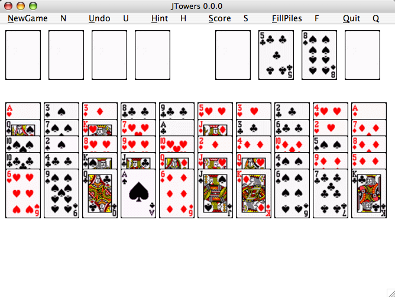

## JTowers

JTowers is an adaptation of the classic seahaven towers solitaire game.

JTowers is inspired by ktowers written by [Keith Packard](http://keithp.com).

JTowers is played with one pack of cards.  The aim of the game is to form 4 piles of cards which run consecutively from the ace to the king of each suit.

## Requirements

  * JRE
  * JDK (if you want to recompile JTowers)

## Getting Started

1. Check out JTowers

    ~~~ sh
    $ git clone git://github.com/shinoburc/JTowers
    ~~~

2. Run

  ~~~ sh
  $ cd JTowers
  $ java -jar JTowers.jar
  ~~~

Have fun!

## etc

- compile

  ~~~ sh
  $ cd JTowers
  $ ./compile.sh
  ~~~

- create jar

  ~~~ sh
  $ cd JTowers
  $ ./gen-jar.sh
  ~~~

## LICENSE

GNU GPLv3.

